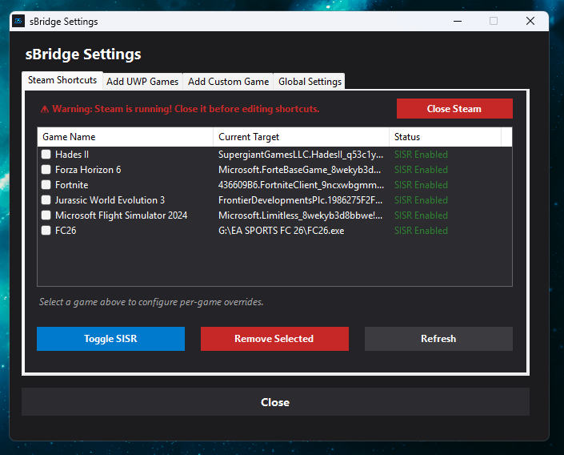
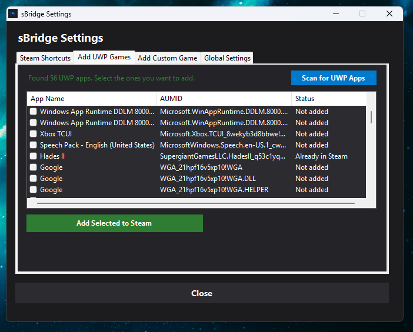
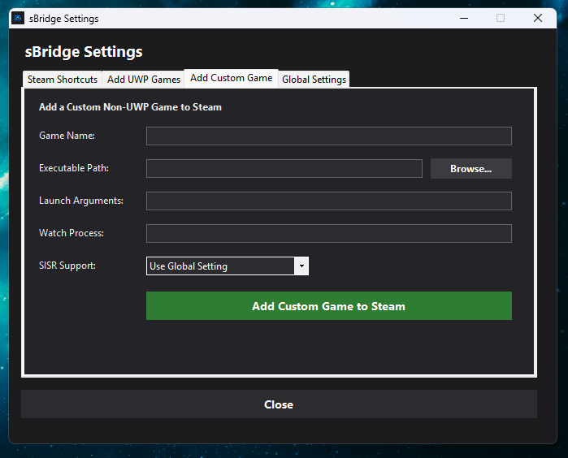
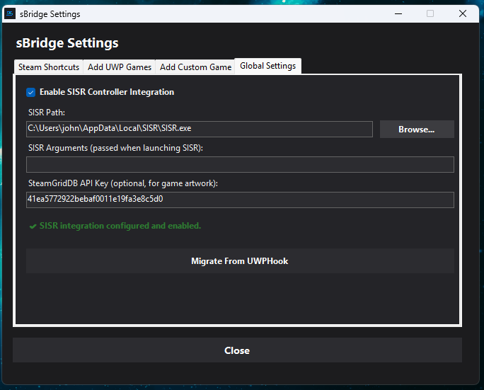

# sBridge

**Play Xbox Game Pass and Windows Store games on Steam with full controller support — automatically.**

sBridge is a lightweight Windows utility that connects UWP games directly to Steam while coordinating [SISR](https://github.com/Alia5/SISR) (Steam Input System Redirector) in the background so you don't have to manage it manually.

## About This Project
This is a personal hobby project created entirely using AI coding assistants to solve a specific problem I personally encountered, designed to make Steam Input work seamlessly with Windows Store / Game Pass games.

## Screenshots

| Steam Shortcuts (Main Tab) | Add UWP Games |
| :---: | :---: |
|  |  |
| **Add Custom Game** | **Global Settings** |
|  |  |

## The Problem

If you play Xbox Game Pass or Windows Store (UWP) games, you've probably run into these issues when trying to add them to Steam:

- **No Native Steam Input**: UWP/Game Pass games are sandboxed and lack standard target `.exe` files, preventing Steam from hooking into them natively. Because of this, custom Steam Input profiles and non-Xbox controllers (PlayStation DualSense, Nintendo Switch Pro, Steam Controller) will not work out of the box.
- **Manual Redirectors**: Tools like **SISR** (Steam Input System Redirector) solve this by translating Steam Input into system-level virtual gamepads, but they require you to manually launch the redirector before starting the game and remember to close it afterward.

Without an automated bridge, forgetting to close the redirector leaves your controller inputs hijacked system-wide, breaking input in other applications.

## The Solution

This bridge does everything for you. When you launch a UWP game from Steam:

1. ✅ **Starts SISR** silently in the background
2. ✅ **Launches your game** directly via Windows Shell COM interfaces
3. ✅ **Waits and monitors** the UWP game process (including launcher-spawned processes)
4. ✅ **Stops SISR** automatically when you close the game
5. ✅ **Exits cleanly** so Steam knows your session is over

You just click "Play" in Steam and everything works.

## Features

- **Built-in Xbox / Store App Scanner** — Cancellable packaged-app discovery that keeps settings responsive and carries available install-directory and executable hints into registered games.
- **Epic Games Support** — Reads Epic Launcher `.item` manifests, registers stable game IDs, and launches through Epic Launcher while monitoring the game process.
- **Add Custom non-UWP Games** — Support importing standard `.exe` executables alongside UWP apps, allowing you to wrap any game to coordinate SISR automatically.
- **Settings Tabbed GUI** — A single, consolidated interface to manage existing shortcuts, scan and add new UWP games, add custom games, and configure settings.
- **Per-Game SISR Profiles** — Enable or disable SISR on a per-game basis directly in the UI instead of relying on a global toggle.
- **Watch Process Name Overrides** — Easily override which process name to track, allowing the bridge to support games with complex launch chains, DRM launchers (like EA Desktop / Ubisoft Connect), and slow-loading anti-cheat clients.
- **SteamGridDB Artwork Integration** — Bounded background downloads of grids, heroes, logos, and icons on import, with validated images and independent failure reporting.
- **One-Click UWPHook Migration** — Effortlessly migrate existing UWPHook shortcuts to use the bridge with a single click.
- **Optional SISR Integration** — Toggle SISR controller redirection on or off. With SISR disabled, the bridge functions as a standalone, lightweight UWP launcher (a pure UWPHook replacement).
- **Lightweight Windows Application** — Built with C#, WinForms, and Windows COM interfaces on .NET 10, without third-party application packages.
- **Silent & Invisible** — Runs in the background with periodic process observation and async exit waits.

## Prerequisites

Before using sBridge, make sure you have:
- **Windows 10 or 11**
- **Steam** installed.
- **[SISR](https://github.com/Alia5/SISR)** (Steam Input System Redirector) installed (only required if you want controller redirection; if you just want to launch UWP games on Steam, SISR is optional).
- A **SteamGridDB API key** (optional, for downloading artwork).
- Framework-dependent source builds/packages require the **.NET 10 Desktop Runtime (x64)**. Self-contained Windows x64 packages include that runtime.

> [!WARNING]
> **Windows SmartScreen Warning**
> Since `sBridge.exe` is a newly released, unsigned executable, Windows Defender SmartScreen may display a warning ("Windows protected your PC") when you run it for the first time. 
> To run it anyway, click **"More info"** and then **"Run anyway"**. If you prefer, you can compile the executable yourself from the source code.

## Quick Start

### Step 1: Place the Executable
Place `sBridge.exe` in a permanent folder, for example:
```
C:\Users\<YourUsername>\Documents\sBridge\
```
For modern source builds, copy **all files** from `artifacts\app` together; the executable needs its DLL and runtime configuration files.

### Step 2: Open the Settings GUI
Double-click `sBridge.exe` (with no arguments).

1. **Configure SISR (optional)** — Auto-detects SISR path. Toggle SISR support on/off.
2. **Configure SteamGridDB (optional)** — Enter your SteamGridDB API key to auto-pull artwork.
3. Settings auto-save; click **"Close"** when finished.

### Step 3: Manage Your Games
> **Note:** Steam must be closed to edit shortcuts. The GUI will prompt you to close it.

Open **Steam Accounts** and check the accounts that should receive imports or
UWPHook migration. Choices auto-save. No accounts are selected implicitly on first
use; an empty or unavailable selection blocks those operations.

- **To Add Xbox / Store Games:** Go to **Add Xbox / Store Games**, click **Scan Packaged Games**, select your games, and click **Add Selected to Steam**. The scan button becomes **Cancel Scan** while working; cancelling or a failed scan retains previous results.
- **To Add Epic Games:** Go to **Add Epic Games**, click **Scan Epic Games**, select games, and click **Add Selected Epic to Steam**. Epic Launcher must be installed and signed in for launching.
- **To Add Custom Games:** Go to **Add Custom Game** tab, fill out the game details, select the executable, and click **Add Custom Game to Steam**.
- **To Migrate Old Games:** Click **Migrate From UWPHook** in the path configurations panel to convert old UWPHook shortcuts automatically.
- **To Remove Games:** Go to **Steam Shortcuts** tab, select your games, and click **Remove Selected**.

Restart Steam and play!

### Launch argument compatibility

Existing packaged shortcuts still use `<AUMID> [executable_hint] [game_args...]`;
custom shortcuts use `"<exe_path>" [game_args...]`. The packaged hint is not a game
argument, even with a watch override. To pass packaged-game arguments without a
hint, reserve its position with `""`, for example `Example_123!Game "" --fullscreen`.

New imports use **`sBridge.exe launch <game-id>`**. sBridge resolves the UUID from
its local registry, including launch target, stored argument tokens, process hints,
and per-game integration choice. The registry is the optional `games` section of
`config.json`, committed atomically with profiles before Steam references the ID.
Existing shortcuts and UWPHook migrations retain their legacy launch formats.

Forwarding now preserves individual arguments, including quoted values with
spaces, empty strings, embedded quotes, Unicode, and trailing backslashes. Custom
launches use .NET's `ArgumentList`; COM activation receives an encoded Windows
argument string. Legacy packaged option construction quotes hints containing spaces.
Steam Exe/AppID calculation is unchanged. Custom launch-argument text entered in
the UI is decoded as a Windows command line into stored tokens; quote values there
as needed. The emitted ID shortcut itself contains no target/hint/argument payload.

Rediscovery with the same provider identity and arguments retains the UUID and
profile. Argument variants get separate IDs/profile choices. Renaming stored game
metadata does not regenerate its UUID or rewrite existing Steam identities. A
missing ID is an error before activation/SISR startup, not a fallback to COM.
Removing a Steam shortcut retains the local registration for manual launch/retry.

### Epic launching

Epic discovery reads `.item` files under the common and per-user
`Epic\EpicGamesLauncher\Data\Manifests` directories. Names retain Unicode;
incomplete/non-executable applications and DLC entries pointing to a different
main game are omitted. Malformed manifests produce warnings, and conflicting
installations for the same catalog identity are omitted rather than arbitrarily
selected. Scanning is read-only and cancellable.

Epic imports use the same **`launch <game-id>`** shortcut and UUID-scoped profile
as other providers. Their identity includes catalog namespace, catalog item ID,
and app name. Activation opens an escaped `com.epicgames.launcher://apps/…` URI;
the launcher handle is not adopted as the game. The session monitor searches
using the manifest executable/install evidence, so Epic Launcher can stay open
after the game ends. Use **Watch Process** to name the actual game if the manifest
points to an anti-cheat/bootstrap executable.

Configure additional game arguments in **Epic Launcher**. This slice does not
forward extra sBridge arguments through an unverified protocol query. Native tests
verify Windows protocol argument delivery and a controlled launcher/bootstrap/game
chain; actual Epic authentication, commercial games, and anti-cheat handoffs still
need gameplay validation. Binaries predating Epic support reject the new
`epicLauncher` launch kind instead of overwriting those registrations.

### SISR ownership

sBridge now tracks the SISR process it starts and cleans it up even if the game
fails to launch. It does not terminate processes by name, kill VIIPER, or reset
Steam Input globally before launch. SISR handles its own normal integration cleanup.

If SISR is already running, sBridge leaves it untouched and reports a conflict
instead of launching another competing instance. Close that instance, or disable
sBridge's SISR integration for the game when managing SISR yourself. Only one
sBridge-managed SISR session per Windows user/session is allowed at a time.

Shutdown first tries the verified owned loopback API (`v0.6.1` and compatible
`v0.6.x` patches), then a window-close request, then only the retained SISR process
handle as a bounded fallback. Forced termination may leave Steam/VIIPER cleanup
incomplete; the log reports it. API reachability alone is not controller readiness.
Configured SISR arguments and inherited Steam launch context are preserved.

#### Managed SISR startup (opt-in)

Enable **Managed SISR startup** in Global Settings to use a compatible
**v0.6.1+ v0.6.x** API. Legacy startup remains the default for existing settings.
Managed mode creates `%LOCALAPPDATA%\sBridge\sisr\sessions\<session-id>\startup.json`
and `SISR.log`, launches from that isolated directory, and uses an owned random
IPv4 loopback API port. The generated JSON contains startup defaults rather than
credentials; advanced arguments remain in memory and can override window defaults.

Managed mode owns `--config`, `--api.listen-address` and `--log.file` (including
`--lf`). Remove those conflicting advanced options or use legacy startup. Relative
advanced paths resolve from the managed session directory; legacy arguments and
working-directory behavior stay available with managed mode off. Inherited Steam
identity/controller environment is preserved; inherited SISR config/API/log paths
are replaced by the owned values.

Before activating a game, managed startup waits up to **15 seconds** for a verified,
compatible API and readable Steam status. Requests are limited to two seconds and
64 KiB each, and listener ownership is checked after connecting before HTTP is
sent. Unsupported versions, early exit or readiness timeout prevent activation;
owned cleanup still runs before the error dialog.

The log reports Steam/CEF, marker/setup, cached VIIPER connection, device count
and effective controller type. It avoids passwords, device identifiers and raw
API bodies. **API readiness is not controller readiness**: no connected controller
is required, and Steam/VIIPER warnings do not by themselves block a game. This
slice does not change Steam profiles, complete first-run setup, or issue global
Steam/VIIPER mutations. Marked, completed sessions have bounded retention as
described below; active or unfinished sessions are preserved.

### Session tracking

sBridge follows multiple launcher/bootstrap/game handoffs and can switch to the
actual game while its launcher remains running. Matching uses PID plus creation
time, launch-time evidence, executable name/path, install boundaries, parent
relationships, and visible windows. It excludes prelaunch candidates, known
maintenance/runtime helpers, and ambiguous near-ties rather than choosing the
first process by name. The monitor observes games and never terminates them.

Internal defaults: one-second scans, 90-second provisional/PID-zero discovery,
three-second matched-game exit grace, 32 handoffs, and ten minutes for a live
provisional process. There is no global game-duration limit. Set **Watch Process**
to the actual game's executable when a launcher uses a different name. Session
IDs, candidate scores/reasons, and handoffs are logged. Protected/service-launched
commercial games and controller gameplay still need real-world validation.

### Artwork downloads

After an account's shortcut save succeeds, artwork jobs capture that entry's
stored Steam AppID and launch identity. Up to **32 jobs** may be pending, with
**two active** at a time. The title area reports pending/finished jobs and warnings;
details are logged independently of shortcut-save results. Closing settings
cancels queued/active jobs and awaits cleanup while keeping the UI responsive.

Requests use typed SteamGridDB JSON, HTTPS-only URLs, bounded retries and
`Retry-After`, a 20-second request budget and a two-minute active-job budget.
Authorization is sent only to the API, never image/CDN hosts. Redirects are
rejected. Responses are capped at 1 MiB JSON and 16 MiB images; images have a
16-million-pixel budget. API keys, response bodies and signed image URLs are not
logged. Search prefers an exact title match, otherwise the first result; explicit
match selection is future work.

PNG and JPEG content is decoded and validated by Windows before staged grid-file
creation. Extensions come from content, and converted icons are real PNGs.
Existing art is retained; this slice does not overwrite it as an automatic repair.
New shortcuts initially have an empty icon. A validated new icon can update only
the same unique shortcut after reloading its VDF and checking the original icon,
account selection and Steam state. If Steam starts or that entry changes, icon
metadata is left untouched and a warning is reported. Missing artwork or a failed
download does not undo an imported shortcut.

### Settings compatibility

Settings are stored as versioned JSON at `%LOCALAPPDATA%\sBridge\config.json`.
Current logs are at `%LOCALAPPDATA%\sBridge\logs\sBridge.log`; the executable
directory no longer needs to be writable for settings/logging. Per-game
**Automatic / Use Global Setting** inherits the global SISR choice, and watch-only
overrides remain when an integration override is removed. Game keys remain
case-insensitive legacy launch targets for old shortcuts. New registrations use
UUID-scoped profiles; returning one to Automatic does not fall back to an old
target override. Legacy profiles remain available to existing shortcuts.

On first startup without JSON state, sBridge imports a valid `sBridge.cfg` beside
the executable. It preserves paths, advanced SISR arguments, integration/watch
choices, and the SteamGridDB key. The original `.cfg` and any `.cfg.bak` are left
untouched for recovery, including their comments/unknown settings. Opaque legacy
settings are retained there, not applied to the new JSON schema. Existing JSON is
authoritative: later edits to `.cfg` do not change the migrated settings.

The SteamGridDB key is protected in JSON with **Windows DPAPI for the current
user**, and its textbox is masked. JSON and its backup contain a protected blob,
not the plaintext key. Configuration copies alone cannot transfer that credential
to another Windows user/profile. Retained legacy files can still contain the old
plaintext key; remove or secure those originals yourself after confirming migration
if you no longer need recovery or the old application version.

Auto-save validates temporary output, retains `config.json.bak`, checks for stale
edits, and atomically replaces the document. Malformed/unsupported schemas,
unreadable files, or undecryptable credentials produce an error instead of defaults
or legacy fallback. No failed load is overwritten. Unknown JSON fields are retained
on save. JSON supports `=` in game paths that the legacy format could not represent.
Game UUIDs are stored alongside profiles. Xbox/Store and Epic discovery and custom
Win32 registration use provider adapters; a registered-game library editor remains
later work.

### Diagnostics and log retention

Open **Diagnostics** and click **Refresh Diagnostics** for a read-only summary of
settings mode, Steam/account counts, library counts, SISR configuration/external
instance count, logging health, and the last managed SISR status. That SISR status
is explicitly **historical**, not a live API probe. Refresh does not start SISR,
contact SteamGridDB, change Steam, or save settings.

**Copy Diagnostics** copies only the safe summary. It omits paths, account names
and IDs, game titles/targets/arguments, device identifiers, credentials and raw
logs. No diagnostic data is sent automatically.

The bridge log is capped at **2 MiB**, with **three rotated archives** (`.1`–`.3`).
Entries carry UTC time, bridge correlation ID and PID. Concurrent writes are
coordinated; failed writes remain non-fatal and are counted in diagnostics.
Known API keys and recognized password/token/secret options are redacted, and
multiline messages are escaped. Local logs can still contain game paths, titles
and non-secret arguments; the copy action does not export those logs.

Managed SISR retention keeps **eight completed, explicitly marked sessions** and
caps each completed SISR log at **4 MiB**. Cleanup runs around managed startup and
shutdown. Active sessions hold a marker lock; starting/ready/incomplete sessions,
older unmarked directories, linked paths and directories with unknown contents
are preserved. Active third-party SISR logs are not trimmed while SISR is writing
them. SISR's own raw logs are distinct from the safe status summary and may contain
its diagnostic identifiers or paths.

## Building from Source
Install the **.NET 10 SDK** on Windows. `global.json` selects the latest installed
stable .NET 10 feature band (minimum 10.0.100). Run from the repository root:

```powershell
powershell.exe -ExecutionPolicy Bypass -File .\build.ps1
```

This publishes a framework-dependent, windowless `win-x64` application with the
embedded icon to `artifacts\app\sBridge.exe`. Keep that folder's files together.
The script resolves its own working directory, including when called through WSL.
It no longer invokes the legacy .NET Framework compiler.

### Distribution packages and Windows CI

Build both Windows x64 ZIP variants:

```powershell
powershell.exe -ExecutionPolicy Bypass -File .\package.ps1
```

Packages and SHA-256 checksums are written to `artifacts\packages`. The default
`0.0.0-dev` label is for local development. `-Version` and `-Revision` record an
explicit package version and reviewed source commit; no release is uploaded.
Each ZIP includes payload hashes, package instructions and licenses. The
**framework-dependent** variant requires the x64 .NET 10 Desktop Runtime; the
**self-contained** variant bundles it. Extract all files together.

The Windows GitHub workflow performs locked restore, warning-as-error build,
portable/native tests, both package modes and non-desktop package smoke checks.
It uploads development packages and TRX results as CI artifacts. Interactive
desktop, installed-SISR and live Steam/controller checks remain separate gates.

Local package startup, hashes and self-contained desktop checks have passed. The
specific development ZIP also passed a fresh Windows Sandbox test without an
installed .NET runtime; see [the validation record](docs/validation/2026-10-08-clean-machine.md).
Hosted Windows CI also passed build/tests/both package checks; see the
[CI validation and artifacts](docs/validation/2026-10-08-hosted-ci.md). A new release
ZIP still needs its own clean-machine check. See the
[release checklist](docs/RELEASE_CHECKLIST.md) for commands and user-assisted steps.

### Build and test

```powershell
dotnet.exe restore .\sBridge.slnx --locked-mode
dotnet.exe build .\sBridge.slnx -c Release --no-restore
dotnet.exe test .\sBridge.slnx -c Release --no-build
```

Run just the VDF tests:

```powershell
dotnet.exe test .\tests\sBridge.Tests\sBridge.Tests.csproj -c Release --no-build --filter FullyQualifiedName~VdfParserTests
```

Tests link the production VDF and AppID logic and use a synthetic fixture; they
do not load the GUI or modify Steam userdata. The fixture is not Steam-captured
evidence for changing AppID quoting. See [fixture notes](tests/sBridge.Tests/Fixtures/README.md).
Persistence tests use temporary files and injected write/backup/replace failures;
a real Windows sharing-violation test skips when running on another OS.
Nullable analysis is enabled for new code; legacy files retain temporary
file-local opt-outs while their subsystems are migrated. Artwork now uses
HttpClient; current Windows build and publish complete without compiler warnings.
SISR decision tests use controlled processes; Windows socket/ownership checks
skip on other OSes. The installed-SISR test is opt-in and skipped by default.
The test project also builds `sBridge.Tests.exe`, a test-only argument-capture/handoff
probe. VSTest loads the assembly without running that entrypoint; Windows launch
tests invoke it to verify actual child argv. It is not part of the published app.

### Steam file safety

Close Steam before editing shortcuts. Imports stop if an existing shortcut file
cannot be read or validated. Saves check for changes since loading, validate
same-directory temporary output, stage a `.bak` backup, and atomically replace
the original. If replacement is unsupported or fails, no direct overwrite is
attempted. The UI reports per-file failures instead of claiming the whole action
succeeded. Imports target only the checked Steam accounts and deduplicate each
account independently. The shortcut list displays each row's account; removal
affects only checked rows in their original files. UWPHook migration uses the
selected account scope.

Account names come from a bounded text-VDF reader for `config\loginusers.vdf`,
with account-ID labels when names cannot be read. Accounts are discovered from
numeric, nonzero `userdata` directories, including accounts without a shortcut
file. Refresh Accounts retains unavailable saved choices visibly, so losing an
account cannot silently broaden the selection. Linked userdata/account/config
directories are not supported write targets.

For an account's first import, validated same-directory temporary output is moved
to `shortcuts.vdf` without overwriting any concurrent creator. No backup is created
when there was no original; a pre-existing backup is retained. Only the config
directory inside an existing account may be created. Unreadable/malformed existing
files and deleted loaded originals never become new empty libraries. Account saves
are independent, so a partial failure is reported and retry skips copies already
present. Use the updated app for scoped edits; older binaries do not apply the new
account-selection setting.

The codec currently supports binary maps, strings, and Int32 values. Unsupported
types, invalid UTF-8/trailers, and oversized/deep inputs are rejected so editing
cannot silently discard them. Real Steam restart/readback and Steam-generated
AppID/quoting fixtures remain validation work.

### Windows smoke check

An optional Windows desktop smoke check, after `build.ps1`, opens an isolated
settings window and runs a SISR-disabled custom executable from a path with spaces:

```powershell
powershell.exe -ExecutionPolicy Bypass -File .\tests\WindowsSmoke.ps1
```

It uses and deletes a temporary app/data copy. It checks migration, unchanged legacy
source, unsupported-schema rejection, and locked-save error reporting. It does not
edit Steam shortcuts or start SISR. Ordinary game exit uses a short grace instead
of a 90-second replacement search. It does not validate packaged games/controllers.

After the Release solution build and `build.ps1`, check argument forwarding through
the actual bridge and a test probe in a path containing spaces:

```powershell
powershell.exe -ExecutionPolicy Bypass -File .\tests\WindowsLaunchArgumentsSmoke.ps1
```

It captures and compares child arguments in a temporary copy with SISR disabled.
The automated COM-string test verifies Windows argument decoding, not packaged-game
COM activation or a particular game's custom argument parser.

Check external-instance protection and cleanup-before-error-dialog with a
controlled named-process stand-in (not an actual SISR/controller stack):

```powershell
powershell.exe -ExecutionPolicy Bypass -File .\tests\WindowsOwnedSisrSmoke.ps1
```

Check a controlled two-hop session through the published bridge:

```powershell
powershell.exe -ExecutionPolicy Bypass -File .\tests\WindowsSessionSmoke.ps1
```

This needs the Release test probe plus published app. It runs temporary
Launcher/Bootstrap/Game processes with SISR disabled and checks the handoff log.
The ID-launch smoke check resolves stored argument tokens and verifies a missing
UUID cannot start a game or SISR:

```powershell
powershell.exe -ExecutionPolicy Bypass -File .\tests\WindowsGameIdSmoke.ps1
```

Check responsive packaged discovery, cancellation, and closing during a scan:

```powershell
powershell.exe -ExecutionPolicy Bypass -File .\tests\WindowsDiscoverySmoke.ps1
```

This uses Windows UI Automation on an interactive desktop and reads installed
Appx and Epic manifest inventory. It cancels the owned packaged discovery command,
checks the Epic scan tab, and verifies no games were registered. Closing settings
awaits scan cleanup asynchronously, including the
temporary script, before exiting. It does not activate packaged applications.
For a separate native read-only inventory check:

```powershell
$env:SBRIDGE_TEST_PACKAGED_DISCOVERY = "1"
try {
    dotnet.exe test .\sBridge.slnx -c Release --no-build --filter FullyQualifiedName~InstalledPackagedInventoryReadOnlyDiscovery
} finally {
    Remove-Item Env:\SBRIDGE_TEST_PACKAGED_DISCOVERY -ErrorAction SilentlyContinue
}
```

Native process/argument tests stage executables locally and run in a serialized
Windows integration collection to avoid overlapping shell/observer test activity.
All desktop scripts set `SBRIDGE_TEST_DATA_DIRECTORY` to an absolute temporary
Windows path and restore it afterward, so they do not use normal LocalAppData
settings. Leave this test-only override unset during ordinary use. Native Windows
secret tests verify DPAPI round trips/tamper rejection and protected JSON backups;
deterministic migration tests use an explicitly labeled fake protector.

Artwork tests inject HTTP responses and use synthetic image/account files, so
they need no real SteamGridDB key or network access. Native image tests validate
the Release application's actual decoder against PNG/JPEG and corrupt payloads.
An additional isolated settings/queue/close check is opt-in:

```powershell
$env:SBRIDGE_TEST_ARTWORK_UI = "1"
try {
    dotnet.exe test .\sBridge.slnx -c Release --no-build --filter FullyQualifiedName~ActualSettingsQueueBoundsConcurrencyAndDefersCloseUntilCancelledJobsFinish
} finally {
    Remove-Item Env:\SBRIDGE_TEST_ARTWORK_UI -ErrorAction SilentlyContinue
}
```

It uses a temporary config/Steam root, a fake in-memory key and an injected
hanging HTTP handler to verify queue bounds, concurrency and close cancellation.

With Steam closed, check account selection and first-file imports against a
synthetic Steam installation:

```powershell
powershell.exe -ExecutionPolicy Bypass -File .\tests\WindowsSteamAccountsSmoke.ps1
```

This verifies empty-selection blocking, selected-only writes, first creation,
existing-file backup, persisted checkboxes, and deduplicated retry. It uses the
test-only `SBRIDGE_TEST_STEAM_DIRECTORY` override, which requires isolated
`SBRIDGE_TEST_DATA_DIRECTORY`; both are restored afterward. It never edits normal
Steam userdata. The script reports a running Steam process before opening the GUI.

For a separate opt-in test of an installed SISR's startup/API/graceful quit:

```powershell
$env:SBRIDGE_TEST_SISR_PATH = Join-Path $env:LOCALAPPDATA "SISR\SISR.exe"
try {
    dotnet.exe test .\sBridge.slnx -c Release --no-build --filter FullyQualifiedName~InstalledSISR
} finally {
    Remove-Item Env:\SBRIDGE_TEST_SISR_PATH -ErrorAction SilentlyContinue
}
```

This requires an interactive Windows desktop and no existing SISR instance. It
uses no-Steam mode and a non-resolving VIIPER target to prevent bundled VIIPER
startup. It does not test Steam profiles, VIIPER/device readiness, or actual
controller input. Normal Steam/game/controller checks still require a configured
SISR installation and user-assisted gameplay validation.

After the Release solution build and publish, check managed configuration/readiness
ordering and cleanup-before-error using a controlled API stand-in:

```powershell
powershell.exe -ExecutionPolicy Bypass -File .\tests\WindowsManagedSisrSmoke.ps1
```

It verifies an isolated cwd/config, readiness before activation, unchanged game
arguments, graceful quit, and unsupported-API failure before the game starts. It
does not launch installed SISR or modify live Steam/controller state.

Check the diagnostics tab and its safe copy payload in an isolated app/data copy:

```powershell
powershell.exe -ExecutionPolicy Bypass -File .\tests\WindowsDiagnosticsSmoke.ps1
```

This verifies a responsive refresh, redacted report and enabled copy action with
unchanged settings/Steam/SISR resources. It does not replace your clipboard.

### Developing through WSL2

Use Windows `dotnet.exe`/`powershell.exe` for authoritative validation. Resolve the
repository path with `wslpath -w "$PWD"` and set an explicit Windows working
directory when invoking CLI commands. For example, from the repository in WSL:

```bash
powershell.exe -NoProfile -ExecutionPolicy Bypass -File "$(wslpath -w "$PWD/build.ps1")"
powershell.exe -NoProfile -Command "Set-Location -LiteralPath '$(wslpath -w "$PWD")'; dotnet.exe test .\sBridge.slnx -c Release --no-build; exit \$LASTEXITCODE"
```

Windows restore/build/test and framework-dependent publish have been verified
from a WSL UNC checkout. Pure-logic tests do not establish Windows COM, Appx,
Steam, or SISR runtime compatibility. See [the modernization plan](docs/MODERNIZATION_PLAN.md)
for current findings, compatibility contracts, and the next bounded phase.

## Changelog

### v0.4.0
- **UI/UX Cleanup & Compact Window**: Reduced the settings form height from 780px to 540px to create a more compact, screen-friendly design.
- **Global Settings Tab**: Restructured path configurations (SISR path, arguments, SteamGridDB API key) and status warnings into their own tab page, freeing up main window space.
- **Toggle SISR Action**: Added a new equal-width action button row in the Shortcuts tab, featuring a "Toggle SISR" button that strictly toggles SISR support (Enabled/Disabled) on selected or checked items.
- **Auto-Saving Settings**: Path settings and checkbox integrations now auto-save instantly when textboxes lose focus or checkbox states change, removing the need for a manual "Save" button.
- **Dynamic Selection Prompts**: Per-game override controls are now hidden under a placeholder prompt until a game shortcut is selected.
- **Dynamic Color Coding**: Color-coded the status column in the Steam Shortcuts list (soft green for Enabled, soft red for Disabled, orange for old UWPHook shortcuts).
- **Embedded Executable Icon**: Created a custom sBridge icon and embedded it directly into the compiled binary and window title bar.
- **sBridge Branding**: Consistently updated all window titles, labels, configuration headers, and messages to use "sBridge".

### v0.3.0
- **UWPHook-like Functionality**: Added native UWP launching via COM, completely removing the dependency on external launchers.
- **Add Custom Games**: Added support for standard `.exe` executables to easily wrap any PC game alongside UWP/Game Pass apps.
- **Consolidated UI**: Reorganized layout into a single window with a tabbed interface containing shortcut lists, UWP scan tools, and custom game utilities.
- **Per-Game SISR Settings**: Added the ability to enable/disable SISR support on a per-shortcut basis (Force Enable, Force Disable, or Global Default) inside the shortcut details panel.
- **DRM Launcher & Watch Overrides**: Fixed issues launching games with complex start chains (e.g. EA App/Origin DRM for FC26) by introducing configurable Watch Process name overrides.
- **Robust Process Search**: Extended the startup search timeout window to 90 seconds (polling every 2 seconds) to comfortably accommodate slow anti-cheat clients and DRM wrappers.
- **SteamGridDB Integration**: Added background artwork downloader (portrait grids, heroes, logos, and PNG-converted icons).
- **Standalone UWP Mode**: Added toggle for SISR redirection to run the bridge as a pure UWPHook replacement.
- **One-Click Migration**: Added a button to automatically upgrade old UWPHook shortcuts to the bridge.
- **Optimized Scanning**: Cached Start Menu lookups for an 8x+ speedup, scanning in under 1 second.
- **Executable Rename**: Renamed compiled output to `sBridge.exe` (with configs/logs renamed to `sBridge.cfg`/`sBridge.log`).
- **Bug Fixes**: Fixed path exceptions caused by double quotes in Steam paths and PowerShell pipeline syntax errors.

### v0.2.0
- **Settings GUI**: Dark-themed WinForms interface for configuring paths and managing Steam shortcuts.
- **Steam Shortcut Automation:** Binary VDF parser/serializer to read and modify Steam's `shortcuts.vdf` files programmatically.
- **Steam Process Detection:** Warns when Steam is running and offers to close it before editing shortcuts.
- **Flexible Matching:** Detects shortcuts regardless of where UWPHook or the bridge is installed.

### v0.1.0
- **Initial Release:** Console-mode bridge that coordinates SISR and UWPHook lifecycles.
- **Silent Execution:** Runs windowless alongside UWP games.
- **Auto-Detection:** Scans common installation paths for SISR and UWPHook.
- **Config File:** Settings stored in sBridge.cfg.

---

## Credits
This project coordinates:
- **SISR** (Steam Input System Redirector) by [Alia5](https://github.com/Alia5) — Redirects Steam Input to system-level virtual gamepads for UWP games. Licensed under [GPL-3.0](https://github.com/Alia5/SISR).
- The COM app launching mechanism is based on the design approach utilized in **UWPHook** by [BrianLima](https://github.com/BrianLima) (licensed under MIT).
- **Luke1505** — [PR #1](https://github.com/jxsparrou/controller-bridge/pull/1) supplied the Epic manifest/protocol, multi-hop launch, account-name, and first-file concepts adapted during modernization. The implementation uses typed parsing, full catalog identities, explicit account scope, and owned session monitoring; the PR remains unmerged.

## License
This project is licensed under the [GNU General Public License v3.0](LICENSE) — see the [LICENSE](LICENSE) file for the full text.
